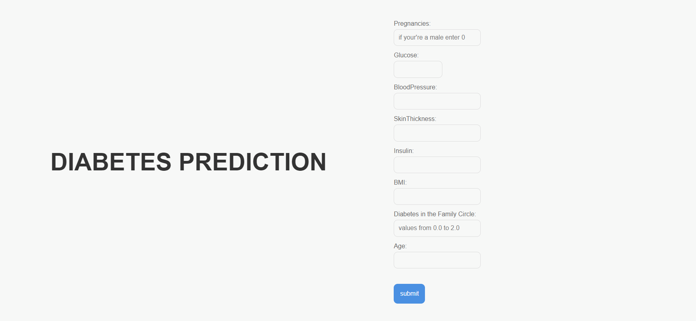

# Diabetes Prediction Web App

## Overview
- This project is a simple web application designed to predict the likelihood of diabetes based on specific input features. The models utilized are logistic regression and random forest classifiers, as this is my first time working on a project of this kind. I plan to incorporate more advanced models in future projects.

- The app was developed using Python, Flask for the backend, and HTML/CSS for the frontend. It’s an end-to-end project covering data preprocessing, model training, and deployment within a user-friendly web interface.

## Project Highlights
 
- Data Processing: Includes handling missing values and scaling features.
- Machine Learning Models: Logistic Regression and Random Forest models.
- Web Application: Built with Flask for backend, HTML/CSS for frontend.
- Deployment: Flask app runs locally for real-time prediction.

## Demo Screenshots
### Home Page


### Result Page


## Project Structure
```
diabetes_prediction
│
├── apps
│   ├── deploy.py                
│   ├── model.joblib          
│   ├── scaler.joblib         
│   ├── templates
│   │   ├── index.html          
│   │   └── result.html       
│   └── static
│       ├── index.css           
│       └── result.css          
│
├── models
│   ├── diabetes.csv            
│   └── diabetes_prediction.ipynb 
│
└── README.md                 
``` 


### Future Scope
This project marks my first attempt at deploying a machine learning model. As I advance, I plan to include more complex models and expand functionality in upcoming projects.

